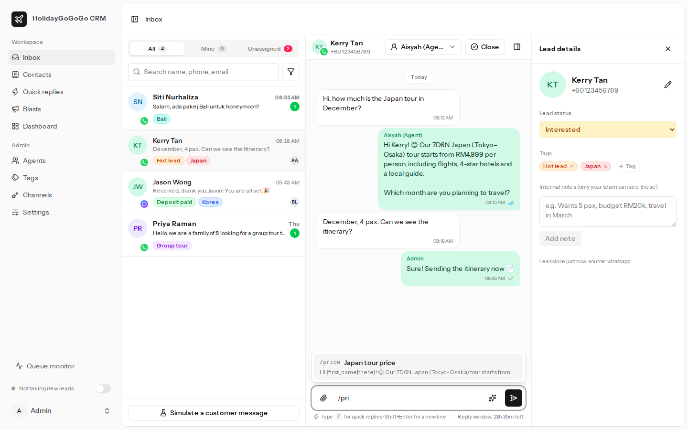
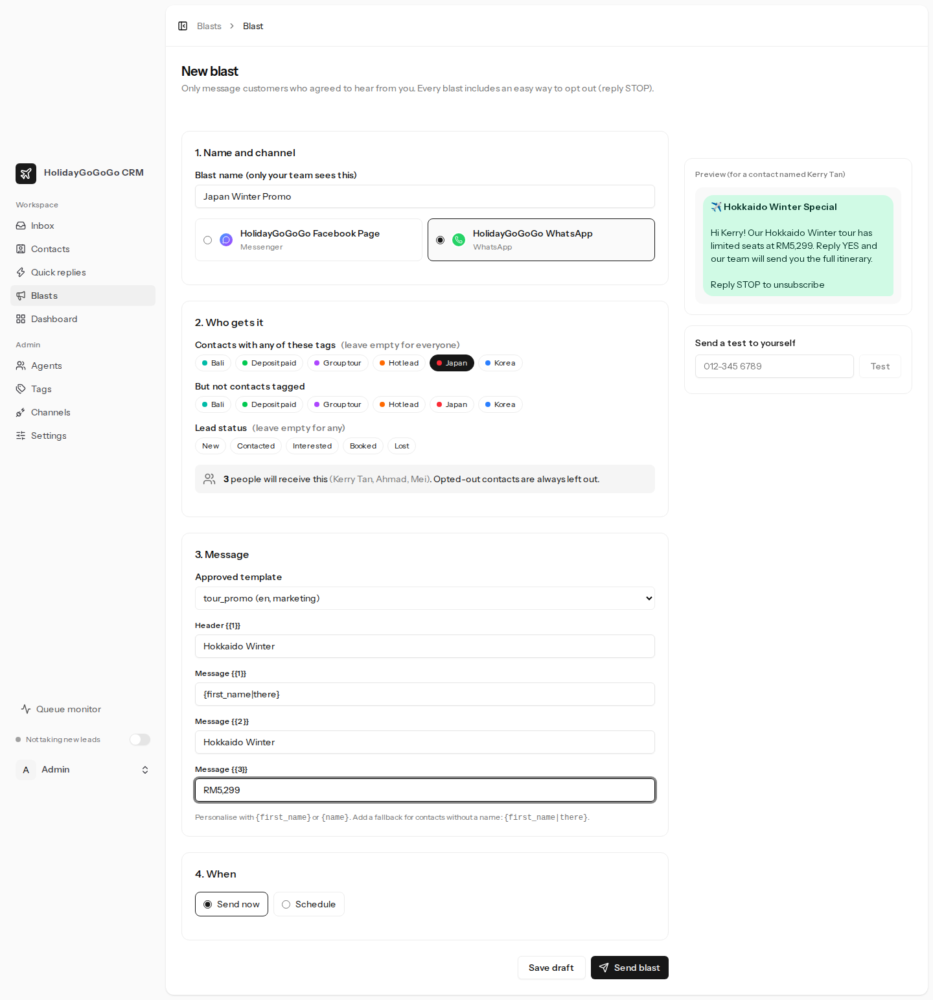
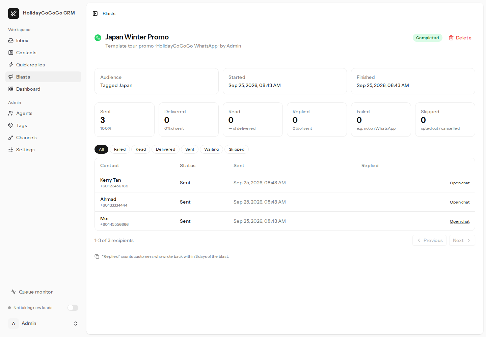
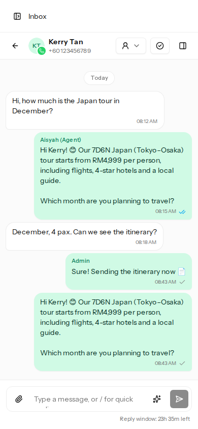

# HolidayGoGoGo CRM

A shared inbox for the HolidayGoGoGo team: every agent logs in to one website to answer **WhatsApp** and **Facebook Messenger** leads, tag them, use saved replies, pass chats to each other and send blasts.



## What it does

| Feature                   | Details                                                                                                                                                                                                                                                                                  |
| ------------------------- | ---------------------------------------------------------------------------------------------------------------------------------------------------------------------------------------------------------------------------------------------------------------------------------------- |
| **Reply to leads**        | One inbox for WhatsApp and your Facebook Page. Photos, files and voice notes are supported, with delivered/read ticks. New messages appear instantly and trigger a sound and desktop notification. Works on phones too.                                                                  |
| **24-hour window**        | Shows how long you can still reply freely. After 24 hours, WhatsApp only allows an approved template, so the chat box switches to "Send template".                                                                                                                                       |
| **Tagging**               | Coloured tags such as `Japan`, `Hot lead` and `Deposit paid`. Tags can be added automatically from keywords: a message containing "tokyo" gets the `Japan` tag. Tags filter the inbox, contacts and blasts.                                                                              |
| **Lead status and notes** | New → Contacted → Interested → Booked / Lost, plus internal notes that customers never see.                                                                                                                                                                                              |
| **Quick replies**         | Type `/` in the chat box and pick a saved reply. `{first_name}` and `{agent_name}` fill in automatically, and a reply can include a PDF or image. Admins manage team replies; agents can also keep personal ones.                                                                        |
| **Agent assignment**      | Assign or transfer chats; the agent gets an instant pop-up. Replying to an unassigned chat claims it, so two agents never answer the same lead. Optional round-robin auto-assign. Admins see each agent's workload.                                                                      |
| **Blasting**              | Pick an audience by tags and lead status (with a live count), choose an approved WhatsApp template, personalise it, send a test to yourself, then send now or schedule. The report shows sent, delivered, read, replied and failed. Customers who reply STOP are left out automatically. |
| **Contacts**              | Every lead in one list, plus CSV import (e.g. from Excel) for blasting.                                                                                                                                                                                                                  |
| **Roles**                 | **Admins** manage agents, tags, channels, settings and blasts, and see every chat. **Agents** see their own chats plus unassigned ones (changeable in Settings).                                                                                                                         |

| Blast builder                                        | Blast report                                       | Phone                                  |
| ---------------------------------------------------- | -------------------------------------------------- | -------------------------------------- |
|  |  |  |

## Tech stack

- **Laravel 13** (PHP 8.4) with **Inertia + Vue 3 + TypeScript + Tailwind CSS**
- **MySQL 8** (SQLite works for trying it out)
- **Laravel Reverb** for real-time updates; the inbox falls back to refreshing every 10 seconds without it
- **Redis + Laravel Horizon** for background jobs; the database queue also works (see [Queues](#queues-redis--horizon-or-database))
- **Meta WhatsApp Cloud API** and **Messenger Platform** (official APIs, no unofficial WhatsApp Web tricks)

---

## Try it on your computer (demo mode)

Demo mode doesn't talk to Meta, so you can try everything before your Meta setup is done.

**You need:** PHP 8.4 (extensions: `pdo_sqlite`, `mbstring`, `intl`, `pcntl`, `posix`), Composer 2, Node.js 22+.
On Windows, use WSL2 or [Laravel Herd](https://herd.laravel.com).

```bash
git clone https://github.com/addmondz/holidaygogogo-crm-automation.git
cd holidaygogogo-crm-automation

composer install
npm install
cp .env.example .env
php artisan key:generate
php artisan reverb:install        # adds the real-time (Reverb) keys to .env

# Turn on demo mode in .env:
#   META_FAKE=true
#   META_WEBHOOK_VERIFY_TOKEN=anything

php artisan migrate
php artisan db:seed --class=DemoSeeder   # sample chats, tags, quick replies and templates
composer dev                              # web server, Vite, Reverb, queue worker and scheduler
```

Open http://localhost:8000 and log in:

| Role  | Email               | Password   |
| ----- | ------------------- | ---------- |
| Admin | `admin@example.com` | `password` |
| Agent | `agent@example.com` | `password` |

To see real-time updates, log in as the admin and the agent in two browser windows. In the inbox, click **Simulate a customer message** to pretend a new lead has written in.

> The demo accounts come from the seeder only. **Never run the seeder on your live server.** Create real accounts with `php artisan crm:create-admin`, then add agents under **Admin → Agents**.

---

## Going live

1. **Server:** follow [docs/DEPLOYMENT.md](docs/DEPLOYMENT.md). Laravel Forge + a small VPS is the easiest route.
2. **Meta:** log in as admin and open **Admin → Meta setup**. The step-by-step wizard walks you from creating your Facebook Page to going live, with links to each Meta page and automatic checks. (The same steps are in [docs/META_SETUP.md](docs/META_SETUP.md).)
3. **First admin:** `php artisan crm:create-admin`
4. In the CRM, go to **Admin → Channels** and add your WhatsApp number and Facebook Page. Click **Test connection**, then **Sync templates**.
5. Add your agents (**Admin → Agents**), tags (**Admin → Tags**) and quick replies.
6. Choose chat visibility and auto-assign under **Admin → Settings**.

---

## How things work

### The 24-hour rule (Meta's rule, not ours)

- **WhatsApp:** you can send any message within 24 hours of the customer's last message. After that, only pre-approved **templates** can be sent (Meta charges per template). Once the customer replies, the window opens again.
- **Messenger:** replies are allowed within 24 hours of the customer's last message. If Meta approves your app for the **Human Agent** feature, set `META_MESSENGER_HUMAN_AGENT=true` to allow replies for up to 7 days.
- **Blasts:** WhatsApp blasts always use templates. Messenger blasts only reach people who messaged your Page in the last 24 hours, because Meta doesn't allow promotional Messenger messages to anyone else.

### Chat visibility and assignment

- Admins see all chats. What agents see is set in **Admin → Settings**: own + unassigned (default), all chats, or own only.
- **Auto-assign** (off by default) shares new leads in turn between agents who are active and switched to "Available for new leads" (the toggle at the bottom of the sidebar).
- Closing a chat moves it out of the "Open" list. It reopens automatically when the customer writes again.

### Opt-out

If a customer sends `STOP` (or another word from **Admin → Settings**), they are marked as opted out and left out of all blasts. `START` opts them back in. Admins can also change this per contact.

### Messages sent outside the CRM

- Replies typed in the **Facebook Page inbox / Meta Business Suite** also appear in the CRM.
- If your WhatsApp number uses **coexistence** (the WhatsApp Business app and the API on the same number), messages sent from the phone also appear when the `smb_message_echoes` webhook field is subscribed.

---

## Queues: Redis + Horizon or database

Slow work (sending messages, processing Meta webhooks, blasts) runs in the background on four queues: `webhooks`, `messages`, `broadcasts` and `default`.

|                | Redis + Horizon (recommended)                                       | Database queue (simplest)                                              |
| -------------- | ------------------------------------------------------------------- | ---------------------------------------------------------------------- |
| `.env`         | `QUEUE_CONNECTION=redis`<br>`CACHE_STORE=redis`                     | `QUEUE_CONNECTION=database`<br>`CACHE_STORE=database`                  |
| Worker command | `php artisan horizon`                                               | `php artisan queue:work --queue=webhooks,messages,broadcasts,default`  |
| Dashboard      | `/horizon` (admins only; the **Queue monitor** link in the sidebar) | none: use `php artisan queue:failed` and `php artisan queue:retry all` |
| Good for       | Many agents, big blasts                                             | Small teams, cheap hosting                                             |

**Switching between them** is only the `.env` change plus the worker command. The code is the same:

1. Wait until no blast is running (jobs already waiting in one queue don't move to the other).
2. Change `QUEUE_CONNECTION` (and `CACHE_STORE`) in `.env`.
3. Run `php artisan config:cache`.
4. Stop the old worker and start the new one (on Forge: edit the daemon).

The blast speed limit (`CRM_BROADCAST_PER_MINUTE`) works with both.

---

## Configuration (`.env`)

| Setting                          | What it does                                                                                                           |
| -------------------------------- | ---------------------------------------------------------------------------------------------------------------------- |
| `APP_URL`                        | Your CRM address, e.g. `https://crm.holidaygogogo.com`. It must be HTTPS in production (Meta requires HTTPS webhooks). |
| `META_APP_ID`, `META_APP_SECRET` | From your Meta app (App settings → Basic). The secret checks that webhooks really come from Meta.                      |
| `META_WEBHOOK_VERIFY_TOKEN`      | Any random text; paste the same value into Meta's webhook settings.                                                    |
| `META_GRAPH_VERSION`             | Graph API version (default `v23.0`).                                                                                   |
| `META_FAKE`                      | `true` = demo mode: nothing is sent to Meta.                                                                           |
| `META_MESSENGER_HUMAN_AGENT`     | `true` only after Meta approves the Human Agent feature.                                                               |
| `CRM_DEFAULT_COUNTRY_CODE`       | Used to turn local numbers into international ones: `60` makes `012-345 6789` into `60123456789`.                      |
| `CRM_BROADCAST_PER_MINUTE`       | Maximum blast messages per minute (default 300).                                                                       |
| `CRM_MAX_UPLOAD_KB`              | Maximum attachment size (default 16 MB, WhatsApp's limit for most media).                                              |
| `BROADCAST_CONNECTION`           | `reverb` for instant updates, or `log` to refresh every 10 seconds instead.                                            |
| `REVERB_*`                       | Real-time server settings, created by `php artisan reverb:install` (see DEPLOYMENT.md for production).                 |

WhatsApp numbers and Facebook Page tokens are **not** in `.env`. They are added in **Admin → Channels** and stored encrypted.

---

## Development

```bash
composer dev          # run everything locally
php artisan test      # 123 feature tests (webhooks, sending, permissions, blasts…)
composer ci:check     # everything CI runs: lint, formatting, TypeScript types, PHP style, tests
vendor/bin/pint       # fix PHP code style
npm run check:fix     # fix JS/Vue formatting and lint
```

Main folders:

```
app/Services/Meta/          WhatsApp & Messenger API clients
app/Services/Webhooks/      Turn Meta webhooks into messages & receipts
app/Services/Inbox/         Sending (Outbox), incoming messages, assignment, templates
app/Services/Broadcasts/    Blast audience and launching
app/Jobs/                   Queued work: sending, media download, blasts
resources/js/pages/         Screens (inbox, contacts, blasts, admin…)
resources/js/components/inbox/   Chat list, chat, composer, lead panel
```

## Troubleshooting

| Problem                                                            | Check                                                                                                                                                                                                                                                    |
| ------------------------------------------------------------------ | -------------------------------------------------------------------------------------------------------------------------------------------------------------------------------------------------------------------------------------------------------- |
| Messages from customers don't arrive                               | Admin → Channels shows the webhook URL and whether `META_APP_SECRET` is set. In Meta, check the webhook is verified and subscribed to `messages`. Check `storage/logs/laravel.log` for "unknown phone number ID". Make sure the queue worker is running. |
| Messages stay on the clock icon                                    | The queue worker isn't running (`php artisan horizon` / `queue:work`).                                                                                                                                                                                   |
| Replies fail with "Re-engagement message"                          | The 24-hour window has closed; send a template instead.                                                                                                                                                                                                  |
| Failed with "(#131030) Recipient phone number not in allowed list" | Your Meta app is still using the test number. Add a real number and switch the app to Live.                                                                                                                                                              |
| The inbox doesn't update by itself                                 | Reverb isn't running or `VITE_REVERB_*` was changed without rebuilding (`npm run build`). The inbox still refreshes every 10 seconds when real-time is unavailable.                                                                                      |
| Scheduled blasts don't start                                       | The scheduler cron isn't set up (`* * * * * php artisan schedule:run`).                                                                                                                                                                                  |
